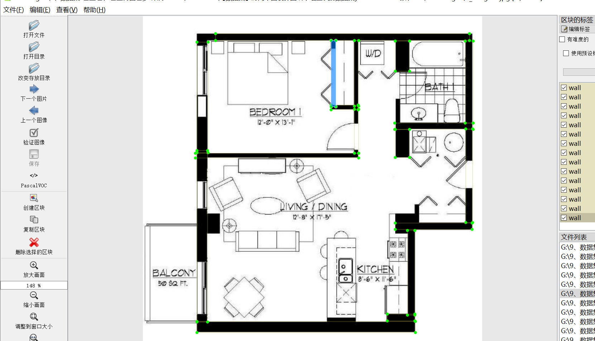
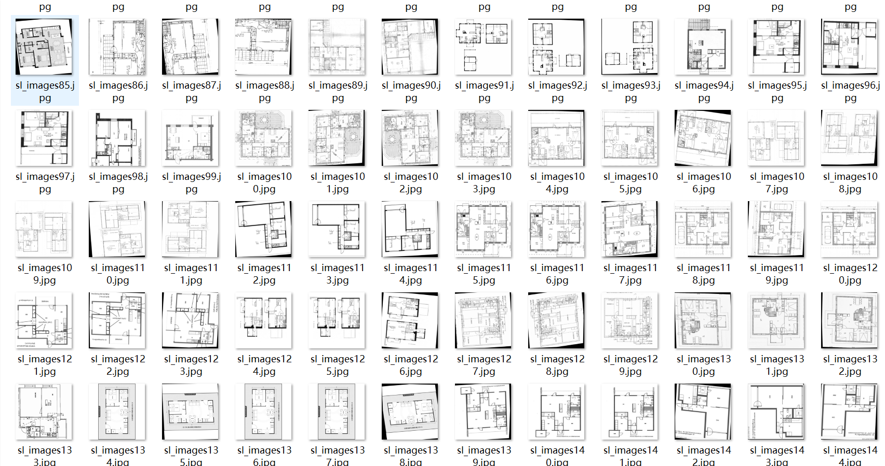
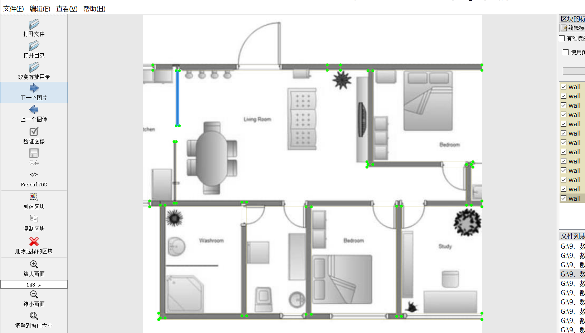

# [Dataset] Flat room Surface blueprint Paper in Wall Recognition Dataset YOLO-VOC 5886 images

Dataset Description: This dataset consists of wall detection datasets for room design planar images.

Dataset Format: VOC format + YOLO format

The compressed file contains: three folders, each storing images, xml files, and text files.

Total jpg images in JPEGImages folder: 5886

The total number of xml files in the Annotations folder is: 5886.

The total number of txt files in the labels folder is 5886.

Number of tag types: 1

Tag names: ["wall"]

Number of boxes per label:

wall frame count = 151920

Total boxes: 151920

Picture clarity (Resolution: Pixels): Clear

Is the image enhanced: No

Shape of the label: Rectangular box, used for object detection and recognition.

Important Note: None

Special Notice: This dataset does not guarantee the accuracy or precision of the trained models or weight files. The dataset only provides accurate and reasonable annotations.

No specific annotation provided.

Image situation:

## Images

---

Here is a pay link on Stripe (https://buy.stripe.com/3cs8yP7sY87d0vu9AB). Please contact me lonlonago@foxmail.com after funding $89, and I will send you a complete data files, thank you!

